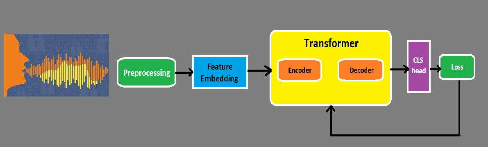

    
<h1 align="center">Speech Recognition</h1>

## 1. Problem Statement
Speech recognition, also known as automatic speech recognition (ASR), is a technology that enables the conversion of spoken language into written text. It is a complex task that involves understanding and processing human speech, which varies widely in terms of accents, pronunciations, speed, and context. Deep learning has revolutionized speech recognition by providing powerful models that can learn from vast amounts of audio data, improving the accuracy and robustness of ASR systems. 

The primary objective of speech recognition is to develop a model that can accurately transcribe spoken words into written text. This involves several key challenges:

- **Acoustic Variability:**  Handling different accents, intonations, and speaking speeds.
- **Background Noise:** Distinguishing speech from various background noises.
- **Context Understanding:** Recognizing and interpreting words within the context of a sentence.
- **Vocabulary Size:** Managing a large vocabulary and differentiating between similar-sounding words.

### Applications

- **Voice Assistants:** Powering virtual assistants like Siri, Alexa, and Google Assistant.
- **Transcription Services:** Automating the transcription of meetings, interviews, and lectures.
- **Accessibility:** Assisting individuals with hearing impairments by providing real-time text transcriptions.
- **Call Centers:** Automating customer service interactions and analyzing call center data.

## 2. Related Works
This section explores existing research and solutions related to speech recognition using deep learning models from 2017 to 2023, including the exact models used, descriptions, and links to their papers or GitHub repositories: 

| Date | Title                                  | Description                                                                                                 | Links                                                                                              |
|------|----------------------------------------|-------------------------------------------------------------------------------------------------------------|----------------------------------------------------------------------------------------------------|
| 2017 | Deep Speech 2                          | Utilizes Recurrent Neural Networks (RNN) with Connectionist Temporal Classification (CTC) loss.             | [Paper](https://arxiv.org/abs/1512.02595) [GitHub](https://github.com/baidu-research/warp-ctc)     |
| 2018 | Transformer ASR                        | Uses Transformer architecture for speech recognition, emphasizing self-attention mechanisms.                 | [Paper](https://arxiv.org/abs/1809.08895) [GitHub](https://github.com/espnet/espnet)               |
| 2019 | QuartzNet                              | A convolutional neural network (CNN) model using 1D time-channel separable convolutions for ASR.             | [Paper](https://arxiv.org/abs/1910.10261) [GitHub](https://github.com/NVIDIA/DeepLearningExamples/tree/master/PyTorch/SpeechRecognition/Jasper) |
| 2020 | Wav2Vec 2.0                            | Combines CNN and Transformer models for self-supervised learning of speech representations.                  | [Paper](https://arxiv.org/abs/2006.11477) [GitHub](https://github.com/pytorch/fairseq/tree/main/examples/wav2vec) |
| 2020 | Conformer-CTC                          | Integrates convolutional layers with Transformer layers for enhanced ASR performance.                        | [Paper](https://arxiv.org/abs/2006.11477) [GitHub](https://github.com/espnet/espnet)               |
| 2021 | HuBERT                                 | Utilizes a masked prediction task to learn hidden representations of speech.                                 | [Paper](https://arxiv.org/abs/2106.07447) [GitHub](https://github.com/pytorch/fairseq/tree/main/examples/hubert) |
| 2022 | Whisper                                | OpenAI's ASR model designed for robustness across different languages and accents.                           | [Paper](https://openai.com/research/whisper) [GitHub](https://github.com/openai/whisper)           |
| 2023 | Efficient Conformer                    | A variant of Conformer with efficient computation tailored for low-latency ASR applications.                 | [Paper](https://arxiv.org/abs/2305.00359) [GitHub](https://github.com/espnet/espnet)               |
| 2023 | E-Branchformer                         | A hybrid model combining Branchformer architecture with enhancements for ASR tasks.                          | [Paper](https://arxiv.org/abs/2305.00120) [GitHub](https://github.com/espnet/espnet)               |

## 3. The Proposed Method
Transformers, originally introduced in the paper "Attention is All You Need" by Vaswani et al. in 2017, have revolutionized natural language processing (NLP) by relying solely on self-attention mechanisms, foregoing recurrent architectures entirely. This innovation has since been adapted for Automatic Speech Recognition (ASR), resulting in substantial improvements.
Transformers have significantly advanced the field of speech recognition, offering powerful models that improve accuracy, efficiency, and scalability. 

Transformers are used in end-to-end models where the raw audio or its features are directly mapped to text without intermediate steps like phoneme recognition. Also, Transformers are combined with other architectures, such as Convolutional Neural Networks (CNNs) or Recurrent Neural Networks (RNNs), to leverage the strengths of multiple approaches. In this task, we used a CNN as featuer embedding method combined with transformer layer.

    
<h4 align="center">Proposed method</h4>

## 4. Implementation
This section delves into the practical aspects of the project's implementation.

### 4.1. Dataset
Under this subsection, you'll find information about the dataset used for the Speech Recognition task. It includes details about the dataset source, size, composition of the dadaset. In this task, we used [The LJ Speech dataset](https://keithito.com/LJ-Speech-Dataset/)

This is a public domain speech dataset consisting of 13,100 short audio clips of a single speaker reading passages from 7 non-fiction books. A transcription is provided for each clip. Clips vary in length from 1 to 10 seconds and have a total length of approximately 24 hours.

The texts were published between 1884 and 1964, and are in the public domain. The audio was recorded in 2016-17 by the LibriVox project and is also in the public domain.

Metadata is provided in transcripts.csv. This file consists of one record per line, delimited by the pipe character (0x7c). The fields are:

- **ID:** this is the name of the corresponding .wav file
- **Transcription:** words spoken by the reader (UTF-8)
- **Normalized Transcription:** transcription with numbers, ordinals, and monetary units expanded into full words (UTF-8).
Each audio file is a single-channel 16-bit PCM WAV with a sample rate of 22050 Hz.
More detail can be found in the above provided link.

### 4.2. Model
In this subsection, the architecture and specifics of the deep learning model employed for the segmentation task are presented. It describes the model's layers, components, libraries, and any modifications made to it.
The whole structure of the model is as below:
    class SpeechRecognitionModel(nn.Module):
    
      def __init__(self,
                   d_model, nhead, num_encoders, num_decoders, dim_feedforward, dropout=0.1, activation=F.relu,
                   cnn_mode='simple', inplanes=32, planes=64,
                   n_mels=128, n_fft=400):
        super().__init__()
    
        # Transform
        self.transforms = nn.Sequential(
            T.Resample(orig_freq=sample_rate, new_freq=16000),
            T.MelSpectrogram(n_mels=n_mels, n_fft=n_fft),
            # T.FrequencyMasking()
            ).requires_grad_(False)
    
        # Feature embedding
        self.cnn_mode = cnn_mode
        if cnn_mode == 'simple':
          self.cnn = CNN2dFeatureExtractor(inplanes=inplanes, planes=planes)
        elif cnn_mode == 'resnet':
          self.cnn = ResNetFeatureExtractor()
        else:
          raise NotImplementedError("Please select one of the simple or resnet model")
    
        # Transformer
        self.transformers = TransformerModel(
            d_model=d_model, nhead=nhead,
            num_encoders=num_encoders, num_decoders= num_decoders,
            dim_feedforward=dim_feedforward, dropout=dropout, activation=activation)
    
        # Classifier
        self.cls = nn.Linear(d_model, len(vocabs))
    
        self.init_weights()
        
As shown in section 3, Proposed Method, the structure of model is composed of several components. In preprocessing section, we used mel transform to get a two dimentional filtered frequency spectrom. The Feature Embedding is where that, CNN is used to extract features from the output of mel spectrum. Then we used TransformModel from Pytorch with the above settings and the final section is a classifier in the size of our vocab.

### 4.3. Configurations
This part outlines the configuration settings used for training and evaluation. It includes information on hyperparameters, optimization algorithms, loss function, metric, and any other settings that are crucial to the model's performance.

**loss_fn =** nn.CrossEntropyLoss(ignore_index=0)

**metric =** WER().to(device)

**Optimizer =** torch.optim.SGD(model.parameters(), lr=0.1, momentum=0.9)

### 4.4. Train

The training process consists of Finding Hyper-parameters and Main loop section. in Finding Hyper-parameters section, we used different scenarios to obtain best hyper-parameters like learning rate, weight decay, and, momentum. The result of this section is used to train the model in Main Loop.

I made a grid of LR and WD like below

learning rate : [ 1, 0.5, 0.1, 0.05, 0.01, 0.001 ]

weight decay: [1e-6, 1e-5, 1e-4]

The best train loss for above grid with two epoch obtained with LR= 0.05, WD= 1e-4, and momentum=0.9

Then, after training the best model from previous step with LR= 0.05, WD=1e-4 for 30 epochs, result shows train loss=0.728 and metric= 0.817 and for validation, loss=0.7552 and metric=0.801.

    

### 4.5. Evaluate
The metric of evaluation using test dataset is 0.801. 

